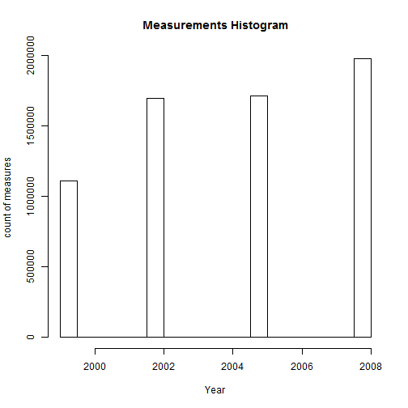
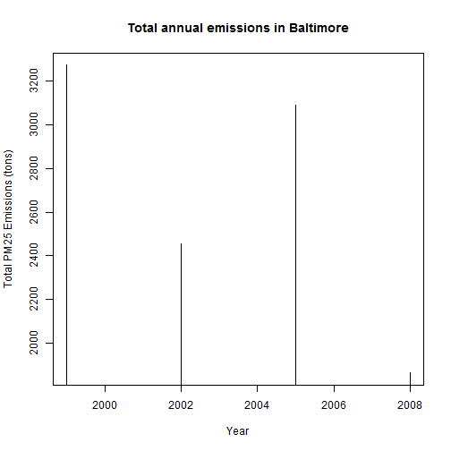
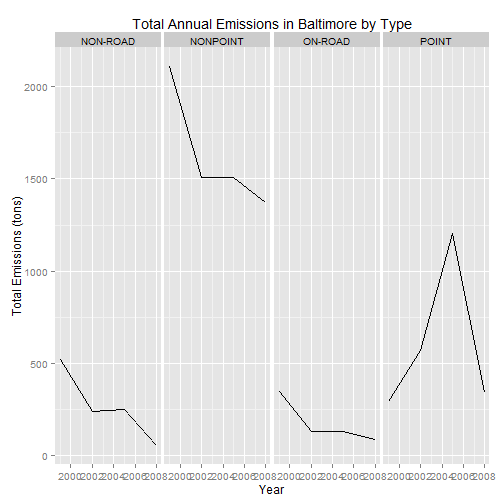
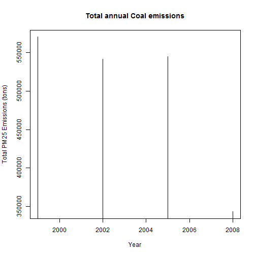
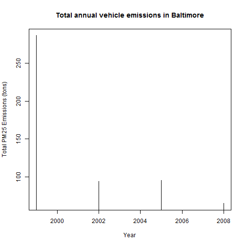
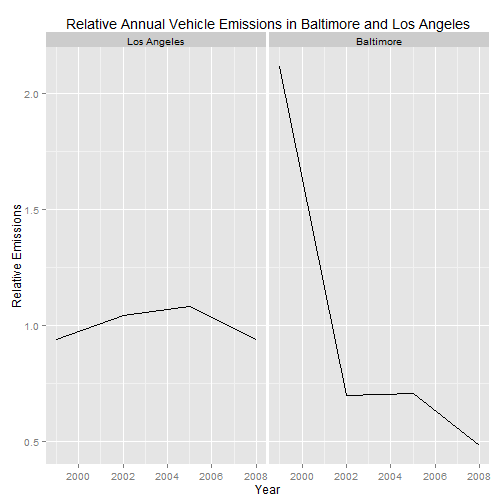

#Assignment

The overall goal of this assignment is to explore the National Emissions Inventory database and see what it say about fine particulate matter pollution in the United states over the 10-year period 1999-2008. You may use any R package you want to support your analysis.

##Introduction

Fine particulate matter (PM2.5) is an ambient air pollutant for which there is strong evidence that it is harmful to human health. In the United States, the Environmental Protection Agency (EPA) is tasked with setting national ambient air quality standards for fine PM and for tracking the emissions of this pollutant into the atmosphere. Approximatly every 3 years, the EPA releases its database on emissions of PM2.5. This database is known as the National Emissions Inventory (NEI). You can read more information about the NEI at the EPA National Emissions Inventory web site.

For each year and for each type of PM source, the NEI records how many tons of PM2.5 were emitted from that source over the course of the entire year. The data that you will use for this assignment are for 1999, 2002, 2005, and 2008.

##Data

The data for this assignment are available from the course web site as a single zip file:
* [Data for Peer Assessment 29Mb](https://d396qusza40orc.cloudfront.net/exdata%2Fdata%2FNEI_data.zip)

The zip file contains two files:

PM2.5 Emissions Data (summarySCC_PM25.rds): This file contains a data frame with all of the PM2.5 emissions data for 1999, 2002, 2005, and 2008. For each year, the table contains number of tons of PM2.5 emitted from a specific type of source for the entire year. Here are the first few rows.
  
   |  fips |     SCC  | Pollutant | Emissions | type  | year  
-- | ----- |--------- | --------- | --------- | ----- | ----  
 4 | 09001 | 10100401 | PM25-PRI  |  15.714   | POINT | 1999  
 8 | 09001 | 10100404 | PM25-PRI  | 234.178   | POINT | 1999  
12 | 09001 | 10100501 | PM25-PRI  |   0.128   | POINT | 1999  
16 | 09001 | 10200401 | PM25-PRI  |   2.036   | POINT | 1999  
20 | 09001 | 10200504 | PM25-PRI  |   0.388   | POINT | 1999  
24 | 09001 | 10200602 | PM25-PRI  |   1.490   | POINT | 1999  

* fips: A five-digit number (represented as a string) indicating the U.S. county 
* SCC: The name of the source as indicated by a digit string (see source code classification table)
* Pollutant: A string indicating the pollutant
* Emissions: Amount of PM2.5 emitted, in tons
* type: The type of source (point, non-point, on-road, or non-road)
* year: The year of emissions recorded

Source Classification Code Table (Source_Classification_Code.rds): This table provides a mapping from the SCC digit strings in the Emissions table to the actual name of the PM2.5 source. The sources are categorized in a few different ways from more general to more specific and you may choose to explore whatever categories you think are most useful. For example, source "10100101" is known as "Ext Comb /Electric Gen /Anthracite Coal /Pulverized Coal".

You can read each of the two files using the readRDS() function in R. For example, reading in each file can be done with the following code:

## This first line will likely take a few seconds. Be patient!
NEI <- readRDS("summarySCC_PM25.rds")
SCC <- readRDS("Source_Classification_Code.rds")

as long as each of those files is in your current working directory (check by calling dir() and see if those files are in the listing).

# Downloading and preprocessing the data
The data is from EPA avalable on:

```r
if (!file.exists("summarySCC_PM25.rds")){
    if (!file.exists("NEI_data.zip")){
        setInternet2(use = TRUE)
        download.file("https://d396qusza40orc.cloudfront.net/exdata%2Fdata%2FNEI_data.zip",
                      "NEI_data.zip",
                      mode="wb")
        }
    # unzip the contents of the zip to working folder
    unzip("NEI_data.zip", exdir=".")
    }
```

## load data into a data frame
The data is RDS data and can be extracted by using readRDS. the below may take a while.

```r
NEI <- readRDS("summarySCC_PM25.rds")
SCC <- readRDS("Source_Classification_Code.rds")
```

#Answering following Questions
You must address the following questions and tasks in your exploratory analysis. For each question/task you will need to make a single plot. Unless specified, you can use any plotting system in R to make your plot.

1.Have total emissions from PM2.5 decreased in the United States from 1999 to 2008? Using the base plotting system, make a plot showing the total PM2.5 emission from all sources for each of the years 1999, 2002, 2005, and 2008.
The list of years are: 1999, 2002, 2005, 2008

```r
hist(NEI$year, xlab="Year", ylab="count of measures", main="Measurements Histogram")
```

 
Since there is only PM25-PRI in the samples, they can be summed up.

```r
library(plyr)
annual_pollutants <- ddply(NEI,.(year),summarise,total_emissions=sum(Emissions))
plot(annual_pollutants, type="h", 
     xlab="Year", ylab="Total PM25 Emissions (tons)", 
     main="Total annual emissions")
```

 

2.Have total emissions from PM2.5 decreased in the Baltimore City, Maryland (fips == "24510") from 1999 to 2008? Use the base plotting system to make a plot answering this question.

```r
Baltimore_city_Maryland_Emissions <- NEI[NEI$fips=="24510",]
baltimore_annual_pollutants <- ddply(Baltimore_city_Maryland_Emissions,.(year),summarise,total_emissions=sum(Emissions))
plot(baltimore_annual_pollutants, type="h", 
     xlab="Year", ylab="Total PM25 Emissions (tons)", 
     main="Total annual emissions in Baltimore")
```

 

3.Of the four types of sources indicated by the type (point, nonpoint, onroad, nonroad) variable, which of these four sources have seen decreases in emissions from 1999-2008 for Baltimore City? Which have seen increases in emissions from 1999-2008? Use the ggplot2 plotting system to make a plot answer this question.

```r
library(ggplot2)
#need to combine emissions per type per year first
baltimore_annual_pollutants_by_type <- ddply(Baltimore_city_Maryland_Emissions,.(year,type),summarise,total_emissions=sum(Emissions))
qplot(year, total_emissions, data=baltimore_annual_pollutants_by_type, facets=.~type, 
      geom="path", ylab="Total Emissions (tons)", xlab="Year", 
      main="Total Annual Emissions in Baltimore by Type")
```

 

4.Across the United States, how have emissions from coal combustion-related sources changed from 1999-2008?
Find the SCC data that has SCC$EI.Sector with the word coal or SCC$SCC.Level.Three having the word "coal"

```r
Scc_level_3_Names <- levels(SCC$SCC.Level.Three)
Scc_level_3_Coal <-Scc_level_3_Names[grep("Coal",Scc_level_3_Names)]
Scc_Codes_Coal <- SCC$SCC[SCC$SCC.Level.Three %in% Scc_level_3_Coal]
US_Coal_Emissions <- NEI[NEI$SCC %in% Scc_Codes_Coal,]
annual_coal_emissions <- ddply(US_Coal_Emissions,.(year),summarise,total_emissions=sum(Emissions))
plot(annual_coal_emissions, type="h", 
     xlab="Year", ylab="Total PM25 Emissions (tons)", 
     main="Total annual Coal emissions")
```

 

5.How have emissions from motor vehicle sources changed from 1999-2008 in Baltimore City? 

```r
Scc_level_3_Vehicles <-Scc_level_3_Names[grep("Vehicle",Scc_level_3_Names)]
Scc_Codes_Vehicles <- SCC$SCC[SCC$SCC.Level.Three %in% Scc_level_3_Vehicles]
Baltimore_Vehicle_Emissions <- Baltimore_city_Maryland_Emissions[Baltimore_city_Maryland_Emissions$SCC %in% Scc_Codes_Vehicles,]
annual_vehicle_emissions_baltimore <- ddply(Baltimore_Vehicle_Emissions,.(year),summarise,total_emissions=sum(Emissions))
plot(annual_vehicle_emissions_baltimore, type="h", 
     xlab="Year", ylab="Total PM25 Emissions (tons)", 
     main="Total annual vehicle emissions in Baltimore")
```

 

6.Compare emissions from motor vehicle sources in Baltimore City with emissions from motor vehicle sources in Los Angeles County, California (fips == "06037"). Which city has seen greater changes over time in motor vehicle emissions?

```r
LosAngeles_County_California_Emissions <- NEI[NEI$fips=="06037",]
LosAngeles_Vehicle_Emissions <- LosAngeles_County_California_Emissions[LosAngeles_County_California_Emissions$SCC %in% Scc_Codes_Vehicles,]
annual_vehicle_emissions_losangeles <- ddply(LosAngeles_Vehicle_Emissions,.(year),summarise,total_emissions=sum(Emissions))
#adding relative value
annual_vehicle_emissions_losangeles$Rel <- annual_vehicle_emissions_losangeles$total_emissions / mean(annual_vehicle_emissions_losangeles$total_emissions)
annual_vehicle_emissions_baltimore$Rel <- annual_vehicle_emissions_baltimore$total_emissions / mean(annual_vehicle_emissions_baltimore$total_emissions)
combined_vehicle_emissions <- rbind(cbind(annual_vehicle_emissions_losangeles, City="Los Angeles"), 
                                    cbind(annual_vehicle_emissions_baltimore, City="Baltimore"))
qplot(year, Rel, data=combined_vehicle_emissions, facets=.~City, 
      geom="path", ylab="Relative Emissions", xlab="Year", 
      main="Relative Annual Vehicle Emissions in Baltimore and Los Angeles")
```

 


#Answers
Making and Submitting Plots
For each plot you should
* Construct the plot and save it to a PNG file.
* Create a separate R code file (plot1.R, plot2.R, etc.) that constructs the corresponding plot, i.e. code in plot1.R constructs the plot1.png plot. Your code file should include code for reading the data so that the plot can be fully reproduced. You must also include the code that creates the PNG file. Only include the code for a single plot (i.e. plot1.R should only include code for producing plot1.png)
* Upload the PNG file on the Assignment submission page
* Copy and paste the R code from the corresponding R file into the text box at the appropriate point in the peer assessment.

